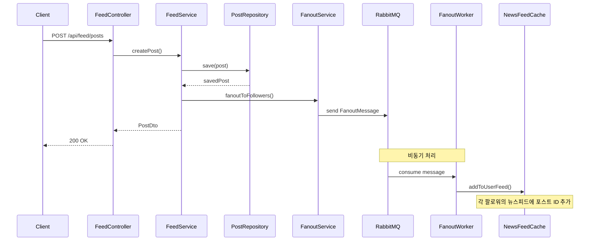
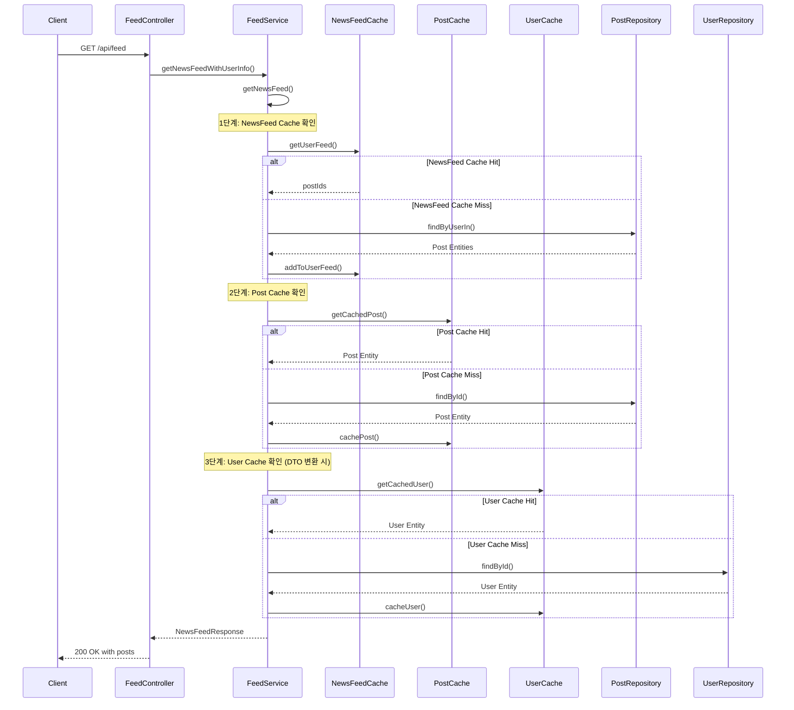

# NewsFeed System

대규모 뉴스피드 시스템 구현 - Instagram 스타일의 팔로잉/팔로워 기반 뉴스피드

## 🏗️ System Architecture

```
┌─────────────────┐    ┌─────────────────┐    ┌─────────────────┐
│   Mobile App    │    │   Web Browser   │    │   API Gateway   │
└─────────┬───────┘    └─────────┬───────┘    └─────────┬───────┘
          │                      │                      │
          └──────────────────────┼──────────────────────┘
                                 │
                    ┌─────────────▼─────────────┐
                    │    Spring Boot App        │
                    │  ┌─────────────────────┐  │
                    │  │   Controllers       │  │
                    │  │  - FeedController   │  │
                    │  │  - UserController   │  │
                    │  │  - MonitorController│  │
                    │  └─────────┬───────────┘  │
                    │            │              │
                    │  ┌─────────▼───────────┐  │
                    │  │   Services          │  │
                    │  │  - FeedService      │  │
                    │  │  - UserService      │  │
                    │  │  - FanoutService    │  │
                    │  │  - FanoutWorker     │  │
                    │  └─────────┬───────────┘  │
                    │            │              │
                    │  ┌─────────▼───────────┐  │
                    │  │   Cache Layer       │  │
                    │  │  - PostCache        │  │
                    │  │  - UserCache        │  │
                    │  │  - NewsFeedCache    │  │
                    │  └─────────┬───────────┘  │
                    └────────────┼──────────────┘
                                 │
          ┌──────────────────────┼──────────────────────┐
          │                      │                      │
    ┌─────▼─────┐        ┌───────▼──────┐        ┌─────▼─────┐
    │   MySQL   │        │   RabbitMQ   │        │   Redis   │
    │ Database  │        │ Message Queue│        │   Cache   │
    └───────────┘        └──────────────┘        └───────────┘
```

## 🔄 Core Flows

### 1. Post Creation & Fanout Flow


### 2. Newsfeed Read Flow


## 📡 API Endpoints

### Feed APIs
- `POST /api/feed/posts` - 포스트 생성
- `GET /api/feed?userId={id}&cursor={id}&limit={size}` - 뉴스피드 조회

### User APIs
- `POST /api/users` - 사용자 생성
- `GET /api/users/{userId}` - 사용자 정보 조회
- `GET /api/users/{userId}/following` - 팔로잉 목록
- `GET /api/users/{userId}/followers` - 팔로워 목록
- `POST /api/users/{followerId}/follow/{userId}` - 팔로우
- `DELETE /api/users/{followerId}/follow/{userId}` - 언팔로우
- `GET /api/users/{followerId}/is-following/{userId}` - 팔로우 여부 확인

### Monitoring APIs
- `GET /api/monitor/metrics` - 시스템 메트릭 조회
- `GET /api/monitor/health` - 헬스 체크

## 📦 Package Structure

```
com.newsfeed.demo/
├── config/                    # 설정 클래스
│   ├── RabbitMQConfig.java   # RabbitMQ 설정
│   ├── RabbitMQConstants.java # RabbitMQ 상수
│   └── RedisConfig.java      # Redis 설정
├── feed/                      # 피드 도메인
│   ├── controller/
│   │   └── FeedController.java
│   ├── service/
│   │   ├── FeedService.java
│   │   ├── FanoutService.java
│   │   └── FanoutWorkerService.java
│   ├── repository/
│   │   └── PostRepository.java
│   ├── entity/
│   │   └── Post.java
│   ├── dto/
│   │   ├── PostDto.java
│   │   ├── CreatePostRequest.java
│   │   └── NewsFeedResponse.java
│   └── cache/
│       ├── PostCacheService.java
│       └── NewsFeedCacheService.java
├── user/                      # 사용자 도메인
│   ├── controller/
│   │   └── UserController.java
│   ├── service/
│   │   └── UserService.java
│   ├── repository/
│   │   ├── UserRepository.java
│   │   └── FollowRepository.java
│   ├── entity/
│   │   ├── User.java
│   │   └── Follow.java
│   ├── dto/
│   │   └── UserDto.java
│   └── cache/
│       └── UserCacheService.java
└── monitoring/                # 모니터링 도메인
    ├── MonitorController.java
    └── MonitoringService.java
```

## 🚀 Execution Method

### 1. Infrastructure Setup
```bash
# Docker Compose로 인프라 실행
docker-compose up -d

# 실행되는 서비스들:
# - MySQL: localhost:3306
# - Redis: localhost:6379
# - RabbitMQ: localhost:5672 (Management: localhost:15672)
```

### 2. Application Execution
```bash
# Gradle로 애플리케이션 실행
./gradlew bootRun

# 또는 빌드 후 실행
./gradlew build
java -jar build/libs/newsfeed-0.0.1-SNAPSHOT.jar
```

### 3. Test Execution
```bash
# 전체 테스트 실행
./gradlew test

# 통합 테스트만 실행
./gradlew test --tests NewsFeedIntegrationTest
```

## 🛠️ Key Technical Stack

- **Framework**: Spring Boot 3.5.4, Java 21
- **Database**: MySQL 8.0, H2 (테스트용)
- **Cache**: Redis 7
- **Message Queue**: RabbitMQ 3
- **ORM**: Spring Data JPA, Hibernate
- **Build Tool**: Gradle
- **Testing**: JUnit 5, Spring Boot Test

## ⚡ Core Features

### 1. **Optimized Cache Strategy**
- **Post Entity**: 캐시에 Post Entity 직접 저장 - 일관성
- **User Entity**: 캐시에 User Entity 직접 저장 - 일관성
- **PostWithUserDto**: API 응답용 (DTO 변환 시 캐시에서 User 정보 조회) - 완전한 데이터

### 2. **Asynchronous Fanout**
- **비동기 처리**: RabbitMQ를 통한 메시지 큐 기반 팬아웃
- **즉시 응답**: 포스트 생성 후 즉시 응답
- **백그라운드 처리**: 팔로워들에게 비동기로 전파

### 3. **Cache Miss Handling**
- **자동 감지**: 뉴스피드 캐시 미스 자동 감지 및 재구성
- **DB 폴백**: 개별 Post/User 캐시 미스 시 DB에서 직접 조회
- **캐시 재구성**: 읽기 시에만 캐시에 저장 (Read-Through)
- **LAZY 로딩 대응**: Post Entity의 User 정보를 캐시에서 별도 조회

### 4. **Performance Optimization**
- **크기 제한**: 캐시 크기 제한으로 메모리 사용량 제어
- **TTL 설정**: 캐시 만료 시간 설정
- **커서 기반 페이지네이션**: 효율적인 뉴스피드 조회

## 📊 Performance Optimization

### 1. **Cache Strategy**
- **PostCache**: TTL 2시간, 최대 100,000개
- **UserCache**: TTL 30분
- **NewsFeedCache**: TTL 1시간, 최대 1,000개

### 2. **Database Optimization**
- **인덱스**: 팔로우 관계 테이블에 복합 인덱스
- **지연 로딩**: JPA FetchType.LAZY 사용
- **커서 기반 페이지네이션**: OFFSET 대신 ID 기반 조회

### 3. **Message Queue**
- **비동기 처리**: 팬아웃을 메시지 큐로 분리
- **확장성**: 워커 인스턴스 확장 가능
- **안정성**: 메시지 처리 실패 시 재시도

## 🧪 Test Scenarios

### 1. **Integration Tests**
- **뉴스피드 플로우**: 사용자 생성 → 팔로우 → 포스트 생성 → 뉴스피드 조회
- **캐시 미스 처리**: 캐시 미스 발생 시 DB에서 재구성
- **팔로우/언팔로우**: 관계 변경 시 캐시 무효화

### 2. **Performance Tests**
- **캐시 히트율**: 캐시 효율성 측정
- **응답 시간**: API 응답 시간 측정
- **메모리 사용량**: 캐시 크기 제한 효과 측정

## 🎯 Design Principles

### 1. **Domain-Driven Design**
- **도메인별 패키지 구조**: user, feed, monitoring
- **계층 분리**: Controller, Service, Repository, Cache
- **의존성 역전**: 인터페이스 기반 설계

### 2. **Separation of Concerns**
- **비즈니스 로직**: Service 계층에 집중
- **데이터 접근**: Repository 계층으로 분리
- **캐시 관리**: 전용 Cache Service로 분리

### 3. **Scalability**
- **수평 확장**: 무상태 설계로 인스턴스 확장 가능
- **캐시 분리**: Redis를 통한 분산 캐시
- **메시지 큐**: RabbitMQ를 통한 비동기 처리

### 4. **Maintainability**
- **상수 분리**: RabbitMQConstants로 설정 중앙화
- **로깅**: 구조화된 로깅으로 디버깅 용이
- **모니터링**: 시스템 메트릭 실시간 조회

## 🔧 Configuration

### Application Properties
```properties
# Database
spring.datasource.url=jdbc:mysql://localhost:3306/newsfeed
spring.datasource.username=root
spring.datasource.password=password

# Redis
spring.data.redis.host=localhost
spring.data.redis.port=6379

# RabbitMQ
spring.rabbitmq.host=localhost
spring.rabbitmq.port=5672
spring.rabbitmq.username=admin
spring.rabbitmq.password=password

# Server
server.port=8080
```

### Cache Configuration
- **PostCache**: TTL 2시간, 최대 100,000개
- **UserCache**: TTL 30분
- **NewsFeedCache**: TTL 1시간, 최대 1,000개

### Message Queue Configuration
- **Exchange**: DirectExchange
- **Queue**: fanout.queue
- **Routing Key**: fanout.routing.key

## 📈 Monitoring & Observability

### System Metrics
- **JVM 메모리**: 힙 사용량, 최대 힙, 사용률
- **CPU**: 시스템 로드, 사용 가능한 프로세서
- **Redis**: 연결 상태, 메모리 사용량, 키 개수
- **RabbitMQ**: 연결 상태, 버전, 총 연결 수

### Health Checks
- **애플리케이션 상태**: `/api/monitor/health`
- **시스템 메트릭**: `/api/monitor/metrics`

## 🚨 Error Handling

### Cache Failures
- **캐시 미스**: DB에서 직접 조회로 폴백
- **Redis 연결 실패**: 로깅 후 DB 조회로 계속 진행

### Message Queue Failures
- **RabbitMQ 연결 실패**: 로깅 후 포스트 생성은 계속 진행
- **메시지 처리 실패**: 개별 팔로워 처리 실패가 전체에 영향 없음

### Database Failures
- **연결 실패**: 적절한 예외 메시지와 함께 실패 응답
- **트랜잭션 실패**: 롤백 후 재시도 로직

## 🔮 Future Enhancements

### 1. **Media Support**
- 이미지, 비디오 업로드 기능
- CDN 연동으로 미디어 서빙

### 2. **Advanced Features**
- 좋아요, 댓글 기능
- 해시태그, 멘션 기능
- 스토리 기능

### 3. **Performance Improvements**
- 읽기 전용 DB 레플리카
- 캐시 계층 추가 (L1, L2 캐시)
- CDN 도입

### 4. **Monitoring & Alerting**
- Prometheus + Grafana 연동
- 알림 시스템 구축
- 로그 집계 시스템

---

**Note**: 이 시스템은 대규모 뉴스피드 서비스의 핵심 아키텍처를 구현한 것으로, 실제 프로덕션 환경에서는 추가적인 보안, 인증, 로드밸런싱, 백업 등의 구성이 필요합니다.
